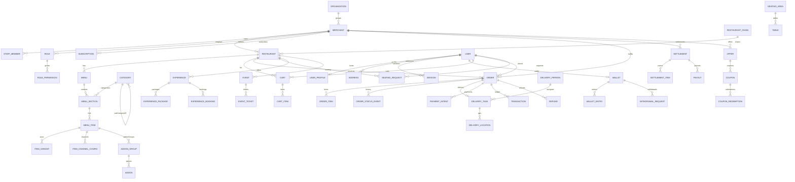

# Entity-Relationship Model (Proposed — For Review)

Status: **DESIGN / FOR REVIEW.** Companion to `postgresql-domain-model.md`. Describes relationships, cardinalities, and referential rules for the canonical Amealio model. No schema/migrations are implemented.

## 1. High-level ERD (core)

## 2. Key relationships & cardinalities

| Relationship | Cardinality | FK / notes |
|--------------|-------------|-----------|
| Merchant → Restaurant | 1 : N | `Restaurant.merchantId` (tenancy root) |
| RestaurantChain → Restaurant | 1 : N | `Restaurant.chainId?` |
| Restaurant → Menu → MenuSection → MenuItem | 1 : N chain | `MenuItem.restaurantId` explicit (fixes legacy gap) |
| MenuItem → ItemVariant / ItemChannelConfig / AddOnGroup | 1 : N | normalizes legacy embedded arrays |
| Category → Category | self 1 : N | `parentId` models Category/Sub-Category |
| User → Address | 1 : N | `Address.userId` explicit (fixes legacy missing FK) |
| User → Wallet | 1 : 1 | `Wallet.userId unique` |
| User → Cart → CartItem | 1 : N | unified cart (guest via `guestToken`) |
| User/Restaurant/Merchant → Order | N : 1 each | composite tenancy on Order |
| Order → OrderItem | 1 : N | item snapshot |
| Order → OrderStatusEvent | 1 : N | replaces embedded audit logs |
| Order → DeliveryTask | 1 : 0..1 | `DeliveryTask.orderId unique` |
| DeliveryTask → DeliveryLocation | 1 : N | time-series GPS |
| Order → PaymentIntent | 1 : N | multiple attempts |
| Order → Transaction | 1 : N | ledger entries |
| Wallet → WalletEntry | 1 : N | balance ledger |
| Merchant → Settlement → SettlementItem/Payout | 1 : N | payout batching |
| Restaurant → SeatingRequest | 1 : N | unified Diner (seating + reservation) |
| SeatingArea → Table | 1 : N | table assignment |
| Restaurant → Experience → Package/Booking | 1 : N | celebration |
| Restaurant → Event → EventTicket | 1 : N | event ticketing |
| Merchant/Restaurant → Offer → Coupon → Redemption | 1 : N | promotions |

## 3. Referential integrity policy

- **All relationships become real FOREIGN KEYs** (Mongo had none).
- **On delete:** default `RESTRICT`; use soft delete (`deletedAt`) instead of hard delete for aggregates with history. Ledger/financial rows are **never** hard-deleted.
- **Snapshots:** `OrderItem` stores a priced snapshot (name/price/customization) so catalog changes don't mutate historical orders.
- **Legacy bridge:** `legacyId` on migrated rows resolves cross-references during ETL; broken legacy `ref` strings (see `docs/migration/04`) are reconciled by value, not blindly.

## 4. Many-to-many resolutions

| Legacy (embedded arrays) | Target join table |
|--------------------------|-------------------|
| `User.favourites[]` / `offerFav` / `eventFav` / `itemFav` | `Favourite`(userId, targetType, targetId) |
| `Menu.categories[].item[]` | `MenuSection` + `MenuItem` FKs |
| `restaurant.selected_*` (Sub Category refs) | `RestaurantFeature`(restaurantId, featureType, featureId) |
| `Offers.restaurants[]` / `vendors[]` | `OfferScope`(offerId, targetType, targetId) |
| Role permission trees | `RolePermission`(roleId, permissionKey, allowed) *or* `Role.permissions JSONB* (decision pending) |

## 5. Tenancy & market on the ERD

- **Tenancy columns** (`merchantId`, `restaurantId`) appear on all merchant-scoped aggregates and are part of hot indexes (see `multi-tenancy.md`).
- **Market columns** (`countryCode`, `currencyCode`) appear only where genuinely market-scoped (Restaurant, Order, Offer, Merchant); global reference tables (Category, Cuisine) are market-agnostic (see `localization-strategy.md`).

## 6. Uncertain relationships — `UNKNOWN — REQUIRES REVIEW`

- Experience ↔ Event ↔ EventTicket boundaries (modeled as siblings for now).
- DeliveryPerson ↔ Nest `locations.driverId` correlation key.
- Whether `SeatingRequest` and `Order` should share a parent "Visit" aggregate (dine-in ordering + seating overlap).
- ONDC entities: kept in a separate bounded context; their FKs to core (restaurant/menu/order) are integration mappings, not hard FKs — pending decision.
- Donation/NGO settlement relationship to the main settlement flow.
