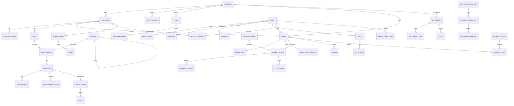
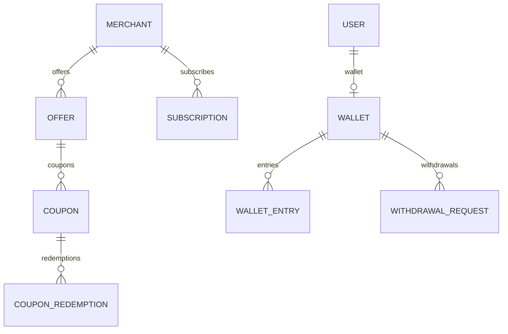
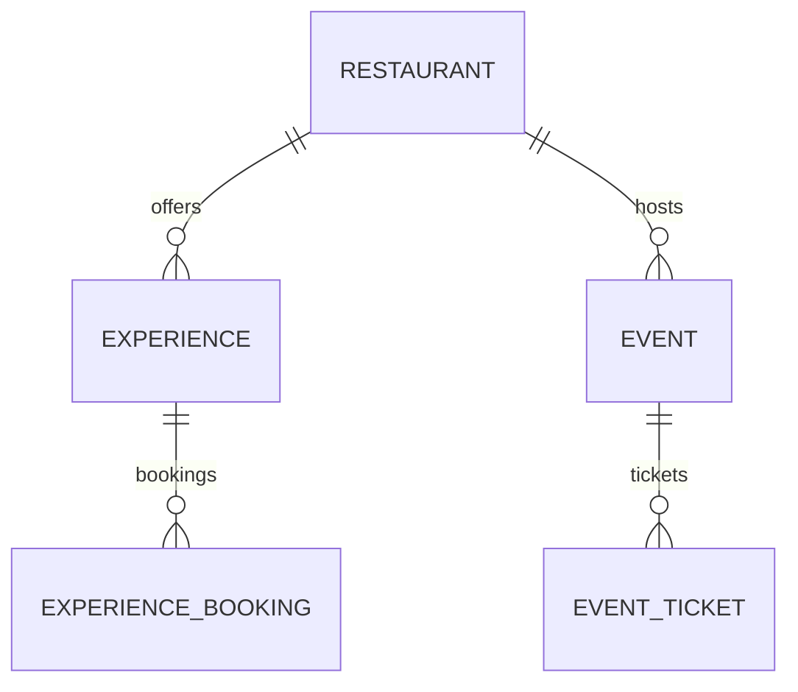

# 17 — Conceptual ERD (India Baseline)

Conceptual entity-relationship diagram for the approved India baseline. Distinguishes **CORE BASELINE** from **OPTIONAL / DEFERRED / UNKNOWN (owner-decision)**. Conceptual only — no schema. Companion to [`entity-relationship-model.md`](../../architecture/entity-relationship-model.md).

## Legend
- **CORE** — required baseline entities.
- **OPTIONAL** — existing, baseline-optional (Promotions, Wallet, Subscription, Reporting read models).
- **PARTIAL** — Delivery orchestration (tracking deferred).
- **UNKNOWN/DEFERRED** — owner-decision (Celebrations/Events/Ticketing, ONDC) — **reserved, not designed-in**.

## CORE baseline ERD

## OPTIONAL (baseline-optional)

## DEFERRED / UNKNOWN (owner-decision — reserved, NOT designed-in)

- **Celebrations/Events/Ticketing** shown for context only; created **only if** OD-1..3 approved.
- **ONDC** = separate bounded context (OD-4) — not in baseline schema.
- **Delivery live-GPS tracking, driver app, recommendations, loyalty** — **no tables** in baseline; attach via seams ([16](./16-FUTURE-EXTENSION-SEAMS.md)).

## Notes
- CORE entities carry tenancy (`merchantId`/`restaurantId`) and audit/soft-delete per conventions ([01](./01-DOMAIN-DATA-MODEL.md), [11](./11-AUDIT-SOFT-DELETE.md), [12](./12-OWNERSHIP-MODEL.md)).
- Financial entities (`Order`, `Transaction`, `Settlement`, `Payout`, `Refund`, `WalletEntry`) are immutable/append-only.
- This ERD is conceptual; cardinalities/constraints detail in [04](./04-RELATIONSHIPS-CONSTRAINTS.md). **No schema is produced.**
